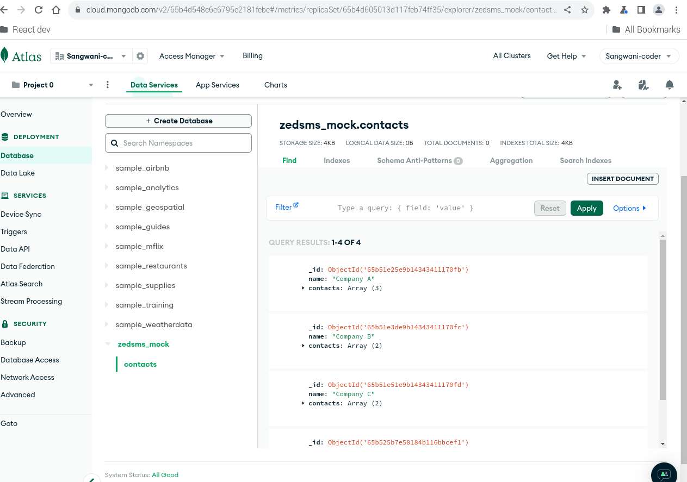

# Fullstack NodeJS & Angular ZEDSMS Bulk Contacts Upload App Mockup
This repository showcases a mock fullstack application demonstrating my skills in NodeJS and Angular development. It simulates one feature of a ZED SMS company's product, offering a glimpse into my ability to build responsive and data-driven web applications.

### Frontend example

### POST Request to API with Postman

### GET Request to API with Postman

### Database status after POST requests in Postman

## Stack:
- Frontend: Angular V17.1.1
- Backend: NodeJS V18.13.0 (Express V4.18.2)
- Database: MongoDB Atlas

## Features:
- CRUD operations for data related to the chosen company feature
- Data validation and error handling.
- Secure connection to MongoDB Atlas for data persistence.
- Responsive UI for displaying and managing data (placeholder for Angular code).

## Current Progress:
- Server-side API built with NodeJS and Express, handling data interactions (including GET and POST requests).
- MongoDB database set up on Atlas and connected to the NodeJS backend.
- Basic data model and CRUD operations implemented on the server side.
- Placeholder UI in the Angular project demonstrating the data structure (needs further development).

## Next Steps:

- Develop the full-fledged Angular UI for a user-friendly and responsive frontend experience.
- Implement data binding and routing for dynamic data interaction and navigation.
- Integrate the Angular frontend with the NodeJS backend API for sending and retrieving data from MongoDB.
- Refine error handling and user feedback mechanisms.
- Style the application for a polished and attractive user interface.

## Benefits of MongoDB Atlas:
- Scalability: Handles large data volumes with ease.
- Flexibility: Schema-less structure adapts to evolving data needs.
- High Availability: Ensures data accessibility and redundancy.
- Cloud-based: Eliminates server management and simplifies deployment.
- This project demonstrates my understanding of fullstack development principles and my ability to utilize modern
technologies like MongoDB Atlas to build efficient and scalable web applications.

For further details on specific aspects of the project, please refer to the individual **READMEs** within the (server)[./csv-app] and (frontend)[./bulkuploads-mock] directories.

Feel free to contribute by suggesting improvements or features for this project. Remember, this is a continuous learning process, and I'm always looking for ways to enhance my skills and knowledge.

## Running the application
1. Frontend (Angular)
### Requirements:

- Node.js v16.13.0 or later
- Angular CLI

#### Instructions:

- Navigate to the angular directory.

    cd bulkuploads-mock

- Install dependencies:
    
    npm install

- Run the development server:

    ng serve

- The application will be available at http://localhost:4200

2. Backend (Node.js)
### Requirements:
- Node.js v16.13.0 or later

#### Instructions:
- Navigate to the server directory.
    
    cd csv-app

- Install dependencies:

    npm install

- Configure your connection to MongoDB Atlas as per their documentation. copy the *uri* from your dashboard.
- Start the server:

    node serve.js

- The server will be running on port 3333 (configurable in server.js)